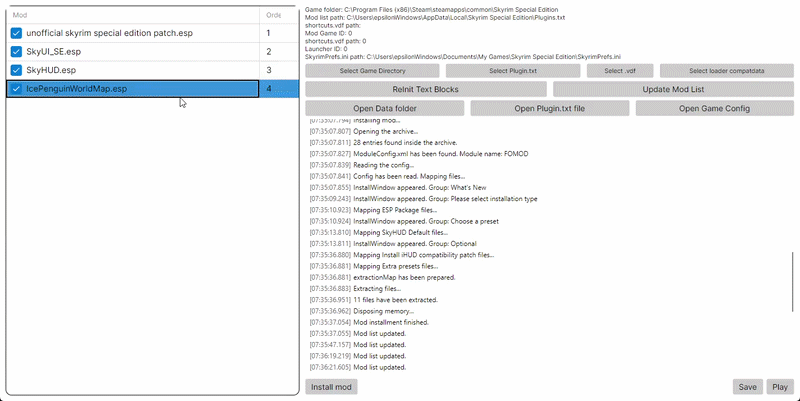
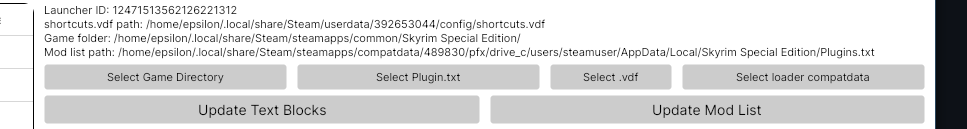
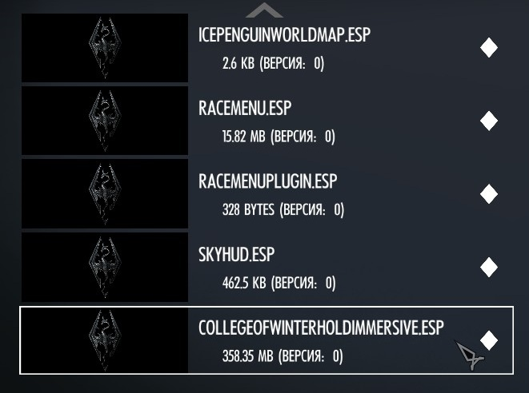
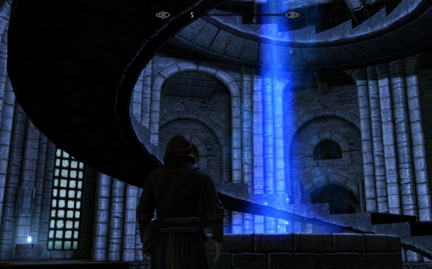

# Vokun Mod Manager
Vokun is a semi-automatic mod manager to help you install and organize mods for Skyrim Special Edition (Steam version) by using skse64_loader.exe as the main launcher both on Linux and Windows. It installs files from archive straight to the Data folder and instantly enables mods.
If you were looking for Mod Organizer 2 or Vortex Mod Manager that works on Linux, this is not the place. Instead, check out [this repository](https://github.com/SulfurNitride/NaK) by [@SulfurNitride](https://github.com/SulfurNitride).

## Installation

### Before you use it
Before installing the manager, make sure you have [Skyrim Script Extender](https://skse.silverlock.org/) installed first. Move all the files inside to game's folder. Also, just in case, launch the original game with proton at least once.

### Installing

Just download the latest release from the [release pages](https://github.com/E1ecTro5/vokun-mod-manager/releases). Yeah, this is a portable software with the archive of its dependencies, no need to install, just download and run <ins>**VokunModManager**</ins> file in it. It would be better if the executable remains in folder, since `config.txt` file will appear next to it.

### Launching application
The only file you need to launch is called `VokunModManager`, that will be inside the archive's folder.
On your first launch, the program will try to initialize all the paths by itself. If everything will work correctly, you'll see full paths above the buttons. If not, please manually select all the necessary stuff.
Next, just install mods, enable/disable them and go play. Just make sure you did everything correct (installation, paths configuration).

## How to use

### So, here is the UI design:

* **`Current mod list`** - on the left side is the list of mods (.esp/.esm/.esl) mentioned in the `Plugins.txt` file. The checkbox represents the `*` symbol in a string, saying whether the mod is currently on or off.
You're also able to reorder them by drag-and-dropping, thanks to [@aldelaro5](https://github.com/aldelaro5) for the [solution](https://github.com/AvaloniaUI/Avalonia/discussions/10877).
> [!NOTE]
> After every launch the app will try to detect paths if they hadn't been initialized before.

* **`Directories and files`** - just some info about:
  + **`Game folder`** - just `Skyrim Special Edition` folder inside the `.../steamapps/common/`
  + **`Mod file path`** - path of the `Plugins.txt file`, which contains info about current mod list. Used by game. Located in `AppData/Local` folder.
  + **`SkyrimPrefs.ini path`** - path of the game's config. Since the main launcher will be replaced, you better to edit it manually. Or, if you want to automatically set graphics settings, just revert the original launcher and open it.
* **`Buttons`**:
  It usually comes with a huge number. The launcher ID will update after that.
  + **`ReInit Text Blocks`** - ask app to auto-detect missing folder/filepaths. Automatically called at launch.
  + **`The rest of the buttons`** - their names speak for themselves. Please initialize manually if textboxes above are null or empty.

> [!WARNING]
> Please, before you start just fill all the TextBoxes above the buttons. You should initialize every path (if it's not detected automatically) and make it look like this (first two strings can be ignored, since they are out of use already):
> 
> Once you finish with all path and file's initializations, move on.

> [!CAUTION]
> Canceling mod's instalation is not included in program yet, be careful.

### Check-in
You can check if you did everything correct in game's "Creations" tab:

Example, College of Winterhold main hall and SkyHUB dot in the centre:

## Features
Completed:
* Launching game through the `skse64_loader.exe`.
* Installing mods straight from archive to `Data` folder.
* Installing mods via FOMOD config.
* Enabling/disabling the mods.
* Changing mods' load order (manually).
* Cancel mod installation (only with config-included ones).
* Cross-platform support (both Windows and Linux).

Coming:
* Automatic mods sorting (priorities, etc.).
* Deleting mods.
* Preset/backup system.
* Nexus integration?
* More mods support.
* Something else...

## Possible issues

### Mods
Not all type of mods are handled by Vokun, so if you install something like FNIS, or complex mods without FOMOD and other stuff, it may give you an exception or just dump all the files to `Data` folder and make a mess.

Also, the "delete mod" feature is not ready yet, just like the profile/preset system, careful with deleting mods manually.

I'll improve this manager and make it better.. one day... if i feel so.. :)
