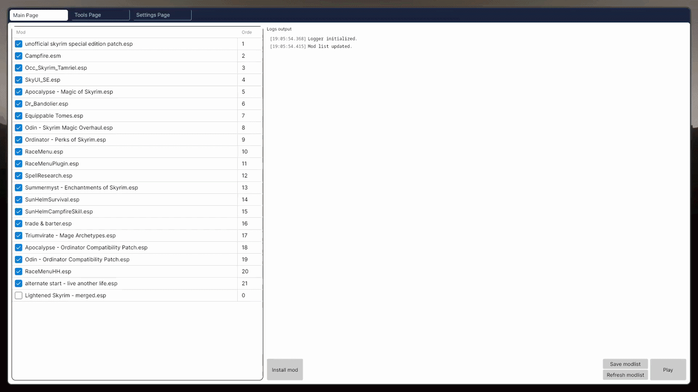
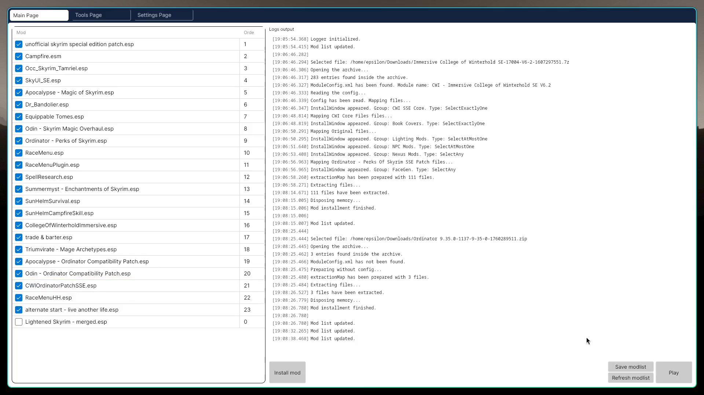
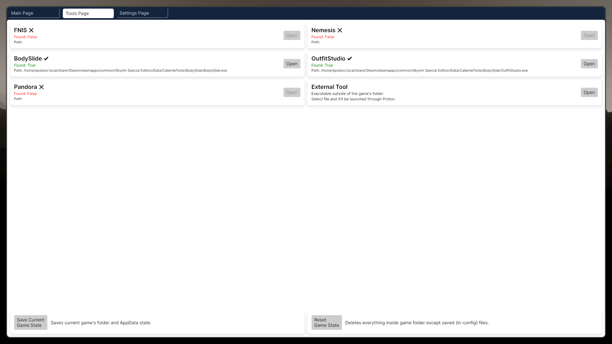
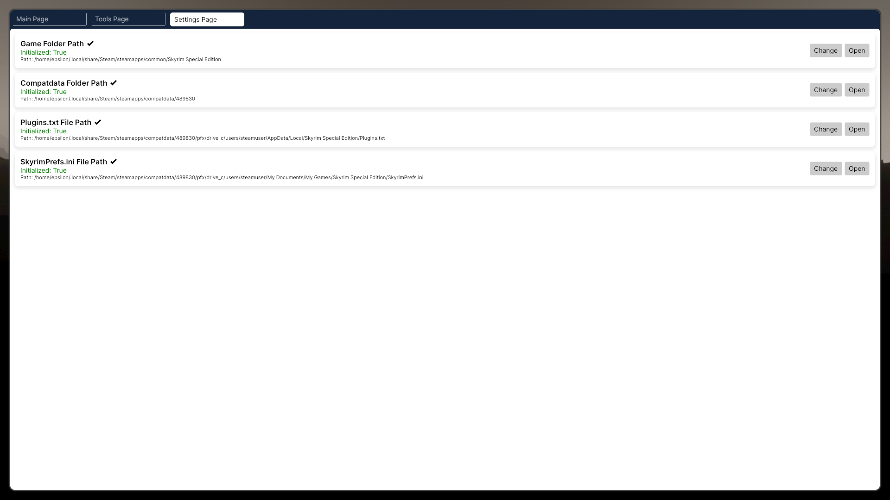

# Vokun Mod Manager
Vokun is a semi-automatic mod manager to help you install and organize mods for Skyrim Special Edition (Steam version) by using skse64_loader.exe as the main launcher both on Linux and Windows. It installs files from archive straight to the Data folder and instantly enables mods.
If you were looking for Mod Organizer 2 or Vortex Mod Manager that works on Linux, this is not the place. Instead, check out [this repository](https://github.com/SulfurNitride/NaK) by [@SulfurNitride](https://github.com/SulfurNitride).

## Installation

### Before you use it
Before installing the manager, make sure you have [Skyrim Script Extender](https://skse.silverlock.org/) installed first. Move all the files inside to game's folder. Also, just in case, launch the original game with proton at least once.

### Installing

Just download the latest release from the [release pages](https://github.com/E1ecTro5/vokun-mod-manager/releases). Yeah, this is a portable software with the archive of its dependencies, no need to install, just download and run <ins>**VokunModManager**</ins> file in it. It would be better if the executable remains in folder, since `config.txt` file will appear next to it.

### Launching application
The only file you need to launch is called `VokunModManager`, that will be inside the archive's folder.
On your first launch, the program will try to initialize all the paths by itself. If everything works correctly, you'll see full paths above the buttons. If not, please manually select all the necessary stuff.
Next, just install mods, enable/disable them and go play. Just make sure you did everything correct (installation, paths configuration).

## How to use

Here is a short .gif that show the process of mod installation, its enabling and order establishment.

## So, here is the UI design:
### Main page

Main page contains functionality to install and order mods.

* **`Navigation bar`** - on the top of the app you can see three tabs. Their names speak for themselves. Just press on them to go on that page.
* **`Current mod list`** - on the left side is the list of mods (.esp/.esm/.esl) mentioned in the `Plugins.txt` file. The checkbox represents the `*` symbol in a string, saying whether the mod is currently on or off.
  You're also able to reorder them by drag-and-dropping, thanks to [@aldelaro5](https://github.com/aldelaro5) for the [solution](https://github.com/AvaloniaUI/Avalonia/discussions/10877).
* **`Logs output`** - logs errors, warnings, mod installation process.

> [!CAUTION]
> Canceling mod installation is not included in program yet, be careful.

### Tools page

This page contains detectors for internal tools, such as `FNIS`, `Pandora` and others, whose files have to be installed inside game's folder.

* **`Internal tools`** - if their files exist in your game's data folder, they will be available to launch. Pressing `Open` will cause Steam to open this tool (via Proton), instead of the game via replacing executables.
* **`External tool`** - made for tools like `XEdit`, which doesn't need to be exactly inside the game's folder. `Open` will cause Steam to open them instead of the game (via Proton).
> [!WARNING]
> Some tools, like [Reliquary](https://github.com/halgari/reliquary) (tool for downgrading/changing game versions) require you NOT TO TOUCH the original game launcher. These kinds of tools you'll need to add a non-steam game and launch them MANUALLY through proton.
* **`Game State`** - saves current game folder state (files state written in specific config). Reset just deletes everything, that config file doesn't include.
> [!WARNING]
> Please, on your first launch, if you've reinstalled the game (clean installation), make a save. Just in case. I haven't made mod remove feature.

### Settings page

* **`Game Folder Path`** - path of the `../Steam/steamapps/common/Skyrim Special Edition/` folder.
* **`Compatdata Folder Path`** - path of the `../Steam/steamapps/compatdata/489830/` folder. Does NOT work/needed on Windows.
* **`Plugins.txt File Path`** - path of the `../Steam/steamapps/compatdata/.../AppData/Local/.../Plugins.txt` file. Plugins (mods togglers) listed here.
* **`SkyrimPrefs.ini File Path`** - path of the `../Steam/steamapps/compatdata/.../Documents/.../SkyrimPrefs.ini` file. Game config/settings.

> [!NOTE]
> The app will try to detect paths on every launch if they are not initialized.

### Check-in
You can check if you did everything correct in game's "Creations" tab:

Example, College of Winterhold main hall and SkyHUB dot in the centre:

## Features
Completed:
* [x] Launching game through the `skse64_loader.exe`.
* [x] Installing mods straight from archive to `Data` folder.
* [x] Installing mods via FOMOD config.
* [x] Enabling/disabling the mods.
* [x] Changing mods' load order (manually).
* [x] Cancel mod installation (only with config-included ones).
* [x] Cross-platform support (both Windows and Linux).
* [x] Internal tools support.
* [x] Basic state saving system.

Coming:
* [ ] Automatic mods sorting (priorities, etc.).
* [ ] Deleting mods.
* [ ] Full preset/backup system.
* [ ] Nexus integration?
